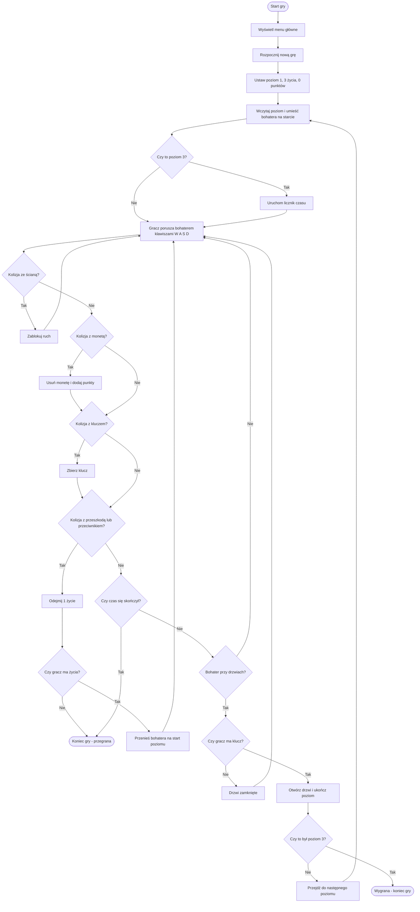

```mermaid
flowchart TD
    Start([Start gry]) --> Menu[Wyświetl menu główne]
    Menu --> Nowa[Rozpocznij nową grę]
    Nowa --> Init[Ustaw poziom 1, 3 życia, 0 punktów]
    Init --> Load[Wczytaj poziom i umieść bohatera na starcie]
    Load --> Czas{Czy to poziom 3?}
    Czas -- Tak --> Timer[Uruchom licznik czasu]
    Czas -- Nie --> Ruch
    Timer --> Ruch

    Ruch[Gracz porusza bohaterem klawiszami W A S D] --> Sciana{Kolizja ze ścianą?}
    Sciana -- Tak --> Blok[Zablokuj ruch] --> Ruch
    Sciana -- Nie --> Moneta{Kolizja z monetą?}

    Moneta -- Tak --> Pkt[Usuń monetę i dodaj punkty] --> Klucz
    Moneta -- Nie --> Klucz{Kolizja z kluczem?}

    Klucz -- Tak --> MaKlucz[Zbierz klucz] --> Przeszkoda
    Klucz -- Nie --> Przeszkoda{Kolizja z przeszkodą lub przeciwnikiem?}

    Przeszkoda -- Tak --> Zycie[Odejmij 1 życie] --> Zyje{Czy gracz ma życia?}
    Zyje -- Nie --> GameOver([Koniec gry - przegrana])
    Zyje -- Tak --> Reset[Przenieś bohatera na start poziomu] --> Ruch

    Przeszkoda -- Nie --> Czas0{Czy czas się skończył?}
    Czas0 -- Tak --> GameOver
    Czas0 -- Nie --> Drzwi{Bohater przy drzwiach?}

    Drzwi -- Nie --> Ruch
    Drzwi -- Tak --> MaK{Czy gracz ma klucz?}
    MaK -- Nie --> Info[Drzwi zamknięte] --> Ruch
    MaK -- Tak --> Otworz[Otwórz drzwi i ukończ poziom] --> Ostatni{Czy to był poziom 3?}

    Ostatni -- Nie --> Nast[Przejdź do następnego poziomu] --> Load
    Ostatni -- Tak --> Wygrana([Wygrana - koniec gry])
```
