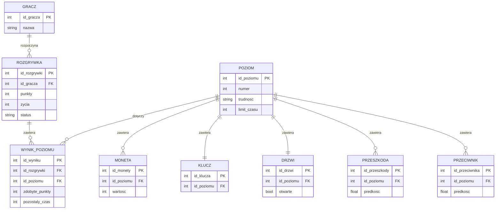

```mermaid
erDiagram
    GRACZ ||--o{ ROZGRYWKA : rozpoczyna
    ROZGRYWKA ||--o{ WYNIK_POZIOMU : zawiera
    POZIOM ||--o{ WYNIK_POZIOMU : dotyczy
    POZIOM ||--o{ MONETA : zawiera
    POZIOM ||--|| KLUCZ : zawiera
    POZIOM ||--|| DRZWI : zawiera
    POZIOM ||--o{ PRZESZKODA : zawiera
    POZIOM ||--o{ PRZECIWNIK : zawiera

    GRACZ {
        int id_gracza PK
        string nazwa
    }

    ROZGRYWKA {
        int id_rozgrywki PK
        int id_gracza FK
        int punkty
        int zycia
        string status
    }

    POZIOM {
        int id_poziomu PK
        int numer
        string trudnosc
        int limit_czasu
    }

    WYNIK_POZIOMU {
        int id_wyniku PK
        int id_rozgrywki FK
        int id_poziomu FK
        int zdobyte_punkty
        int pozostaly_czas
    }

    MONETA {
        int id_monety PK
        int id_poziomu FK
        int wartosc
    }

    KLUCZ {
        int id_klucza PK
        int id_poziomu FK
    }

    DRZWI {
        int id_drzwi PK
        int id_poziomu FK
        bool otwarte
    }

    PRZESZKODA {
        int id_przeszkody PK
        int id_poziomu FK
        float predkosc
    }

    PRZECIWNIK {
        int id_przeciwnika PK
        int id_poziomu FK
        float predkosc
    } 
```
