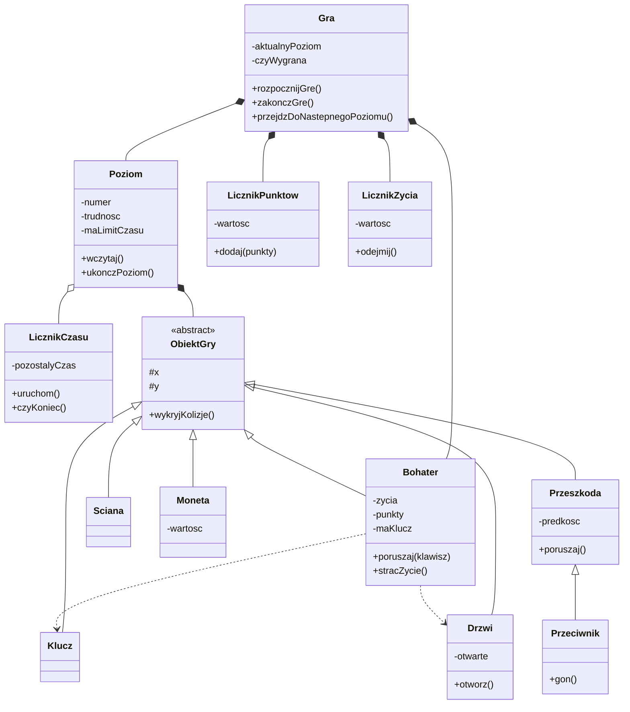

```mermaid
classDiagram
    direction TB

    class Gra {
        -aktualnyPoziom
        -czyWygrana
        +rozpocznijGre()
        +zakonczGre()
        +przejdzDoNastepnegoPoziomu()
    }

    class Poziom {
        -numer
        -trudnosc
        -maLimitCzasu
        +wczytaj()
        +ukonczPoziom()
    }

    class LicznikPunktow {
        -wartosc
        +dodaj(punkty)
    }

    class LicznikZycia {
        -wartosc
        +odejmij()
    }

    class LicznikCzasu {
        -pozostalyCzas
        +uruchom()
        +czyKoniec()
    }

    class ObiektGry {
        <<abstract>>
        #x
        #y
        +wykryjKolizje()
    }

    class Bohater {
        -zycia
        -punkty
        -maKlucz
        +poruszaj(klawisz)
        +stracZycie()
    }

    class Sciana
    class Moneta {
        -wartosc
    }
    class Klucz
    class Drzwi {
        -otwarte
        +otworz()
    }
    class Przeszkoda {
        -predkosc
        +poruszaj()
    }
    class Przeciwnik {
        +gon()
    }

    Gra *-- Poziom
    Gra *-- Bohater
    Gra *-- LicznikPunktow
    Gra *-- LicznikZycia 
    Poziom o-- LicznikCzasu
    Poziom *-- ObiektGry

    ObiektGry <|-- Bohater
    ObiektGry <|-- Sciana
    ObiektGry <|-- Moneta
    ObiektGry <|-- Klucz
    ObiektGry <|-- Drzwi
    ObiektGry <|-- Przeszkoda
    Przeszkoda <|-- Przeciwnik

    Bohater ..> Klucz
    Bohater ..> Drzwi
```
