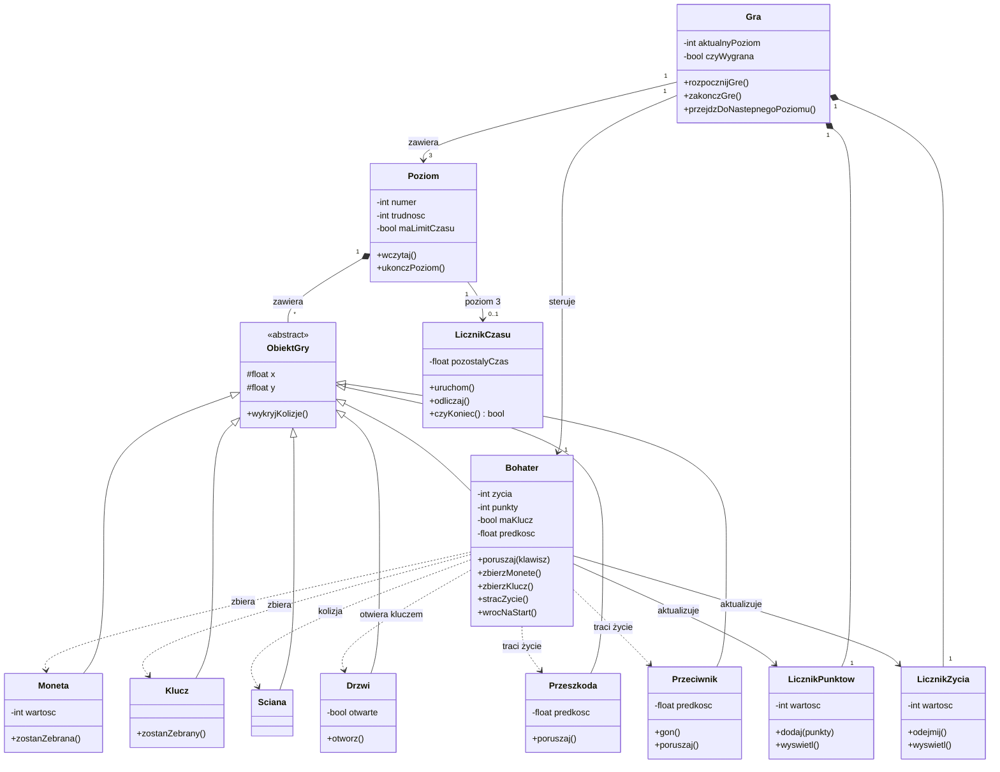

```mermaid
classDiagram
    class Gra {
        -int aktualnyPoziom
        -bool czyWygrana
        +rozpocznijGre()
        +zakonczGre()
        +przejdzDoNastepnegoPoziomu()
    }

    class Poziom {
        -int numer
        -int trudnosc
        -bool maLimitCzasu
        +wczytaj()
        +ukonczPoziom()
    }

    class Bohater {
        -int zycia
        -int punkty
        -bool maKlucz
        -float predkosc
        +poruszaj(klawisz)
        +zbierzMonete()
        +zbierzKlucz()
        +stracZycie()
        +wrocNaStart()
    }

    class ObiektGry {
        <<abstract>>
        #float x
        #float y
        +wykryjKolizje()
    }

    class Sciana
    class Moneta {
        -int wartosc
        +zostanZebrana()
    }

    class Klucz {
        +zostanZebrany()
    }

    class Drzwi {
        -bool otwarte
        +otworz()
    }

    class Przeszkoda {
        -float predkosc
        +poruszaj()
    }

    class Przeciwnik {
        -float predkosc
        +gon()
        +poruszaj()
    }

    class LicznikPunktow {
        -int wartosc
        +dodaj(punkty)
        +wyswietl()
    }

    class LicznikZycia {
        -int wartosc
        +odejmij()
        +wyswietl()
    }

    class LicznikCzasu {
        -float pozostalyCzas
        +uruchom()
        +odliczaj()
        +czyKoniec() bool
    }

    Gra "1" --> "3" Poziom : zawiera
    Gra "1" --> "1" Bohater : steruje
    Poziom "1" *-- "*" ObiektGry : zawiera
    Poziom "1" --> "0..1" LicznikCzasu : poziom 3
    Gra "1" *-- "1" LicznikPunktow
    Gra "1" *-- "1" LicznikZycia

    ObiektGry <|-- Bohater
    ObiektGry <|-- Sciana
    ObiektGry <|-- Moneta
    ObiektGry <|-- Klucz
    ObiektGry <|-- Drzwi
    ObiektGry <|-- Przeszkoda
    ObiektGry <|-- Przeciwnik

    Bohater ..> Moneta : zbiera
    Bohater ..> Klucz : zbiera
    Bohater ..> Drzwi : otwiera kluczem
    Bohater ..> Przeszkoda : traci życie
    Bohater ..> Przeciwnik : traci życie
    Bohater ..> Sciana : kolizja
    Bohater --> LicznikPunktow : aktualizuje
    Bohater --> LicznikZycia : aktualizuje
```
